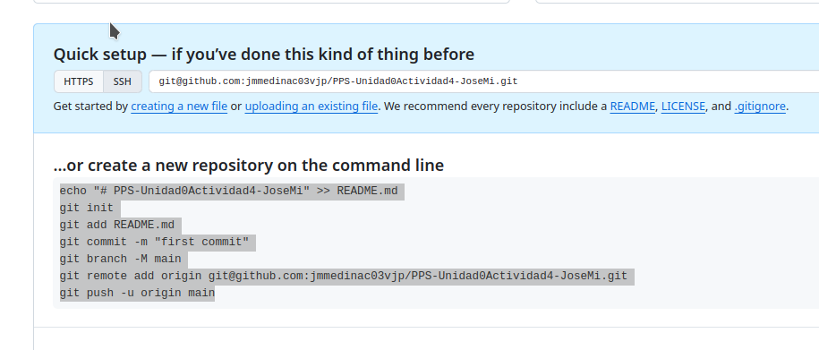

# PPS-Unidad0Actividad4-JoseMi
===
Vamos a hacer una nueva actividad con git. En esta ocasión crearemos un pequeño proyecto de una página web que podremos visualizar creando un pequeño servidor con php.
Como en la actividad anterior el producto a realizar será el repositorio en github. Allí tendrás que documentar la realización de la práctica con la explicación del procedimiento, sus imágenes, etc.

# Creación de Proyecto y repositorio

Para ello crea una nueva carpeta en tu directorio de git de PPS, con el nombre de esta actividad ___PPS-Unidad0Actividad4-TuNombre___

Crea un nuevo repositorio público con nombre __PPS-Unidad0Actividad4-TuNombre__

Sigue las indicaciones de github para crear tu nuevo repositorio en linea de comandos, esto es:

Viene a ser como esto, pero cambiando el nombre de usuario y de repositorio:

~~~
echo "# PPS-Unidad0Actividad4-JoseMi" >> README.md
git init
git add README.md
git commit -m "first commit"
git branch -M mainç
git remote add origin git@github.com:jmmedinac03vjp/PPS-Unidad0Actividad4-JoseMi.git
git push -u origin main
~~~
---
#Trabajo con git

1. Haz un listado en forma de arbol (tree -a) de todos los archivos del directorio.
2. Crea un archivo con nombre README (si no existe todavía) y lo añades al proyecto.
3. Comprueba el estado de git. 
4. Escribe en él una descripción de la actividad y vuelves a comprobar su estado.
5. Crea un archivo con nombre index.php. 
6. Introduce el código html para que nos muestre un mensaje de Hola mundo con tu nombre. Uno sencillo sería este: ``<H1>Hola¡¡¡ Qué tal te encuentras</H1>`
7. Añade el archivo index.php al proyecto.
8. Visualiza el estado del proyecto  (git status)
9. Haz un commit.
1. Sube los cambios a tu repositorio de github (git push)

# Creación de nuestro servidor web y visualización de nuestro proyecto

1. Ejecuta php -S 0:8080 para lanzar un servidor con la página html que has creado.
2. Visualiza la página creada Puedes acceder a ella en tu navegador en el puerto 8080 de tu equipo: 

#Trabajo con git
1. Modifica el fichero index.php
2. Verifica estado del proyecto.
Refresca navegador para comprobar que ha cambiado.
Vuelve a la versión anterior del archivo index.php (git restore).
Vuelve a refrescar navegador para ver como vuelve a versión inicial.
Para finalizar y ver cómo funcionan los comandos pull y push, haz un push y comprueba cómo han subido los archivos a github.com.
Modifica el archivo index.php desde la página de github.com y haz un pull y comprueba cómo se ha modificado la página web en nuestro navegador.
Vamos ahora una pequeña aplicación que nos va a permitir ver información y avatar subida por nosotros: 

Clona el repositorio https://github.com/jmmedinac03vjp/pps0-1
Visualiza con php el contenido de la página web.
Introduce dentro de la carpeta img una imagen de tu avatar.
Dentro de la carpeta profile crea un archivo html con el mismo nombre del archivo de la imagen que copiaste.
Lanza el comando php para que se muestre el contenido de la página web y ver cómo se ha modificado.
